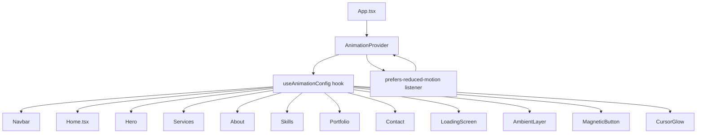

# Design Document — Animation & Interaction Overhaul

## Overview

This document describes the technical design for the v2 animation system overhaul of Rhenmart Dela Cruz's portfolio. The primary goals are:

1. **Remove all canvas/rAF rendering** — replace with CSS-only `AmbientLayer`
2. **Unify device detection** — single `AnimationProvider` context, consumed via `useAnimationConfig()`
3. **Fix UX bugs** — Hero icon, mobile card visibility, Portfolio empty state, Contact filled-state
4. **Add new interactions** — `MagneticButton`, enhanced `CursorGlow`, `Toast`, mobile menu overlay, swipe-to-close modal
5. **Enforce a cross-platform optimization matrix** — high/mid/low tier gates every effect

The stack is unchanged: React 18 + TypeScript + Vite, Framer Motion (`motion/react`), Tailwind CSS, lucide-react.

---

## Architecture

### Device Tier Classification

`AnimationProvider` runs `detectDeviceCapability()` once on mount and publishes the result via React context. All components read from context instead of calling the utility directly.

```
Tier   | Criteria
-------|------------------------------------------------------------------
high   | Desktop Chrome/Edge/Firefox, ≥8 cores OR ≥4 cores + no Safari
mid    | Desktop Safari, high-end mobile Chrome (≥6 cores iOS excluded)
low    | iOS (any), mid/low Android (<4 cores), prefers-reduced-motion
```

### Data Flow



`AnimationProvider` also attaches a `matchMedia` listener for `prefers-reduced-motion` so `reduceMotion` updates reactively without a page reload.

---

## Components and Interfaces

### AnimationContext (`src/app/context/AnimationContext.tsx`) — NEW

```typescript
interface AnimationConfig {
  tier: 'high' | 'mid' | 'low';
  reduceMotion: boolean;
  isSafari: boolean;
  isIOS: boolean;
  isMobile: boolean;
  // Derived feature flags
  enableAmbientLayer: boolean;   // tier !== 'low' && !isSafari
  ambientDotCount: number;       // 12 desktop / 6 mobile / 0 low+Safari
  enableCursorGlow: boolean;     // tier === 'high'
  enableMagnetic: boolean;       // tier === 'high'
  enable3DTilt: boolean;         // tier === 'high'
  enableParallax: boolean;       // tier === 'high'
  enableBackdropBlur: boolean;   // !isSafari && !isIOS
}

// Context
const AnimationContext = createContext<AnimationConfig>(defaultConfig);

// Provider
export function AnimationProvider({ children }: { children: ReactNode })

// Hook
export function useAnimationConfig(): AnimationConfig
```

The provider computes the config once on mount, then only re-renders when `reduceMotion` changes (via the media query listener). All other values are stable for the session.

---

### AmbientLayer (`src/app/components/AmbientLayer.tsx`) — NEW

Replaces `ParticleField`, `StellarBackground`, `LiveBackground`, and `ParticleCanvas`.

```typescript
interface AmbientLayerProps {
  className?: string;
}
```

**Rendering rules:**
- `tier === 'low'` or `isSafari` → renders `null`
- `isMobile` → renders 6 dots
- desktop → renders 12 dots

**Implementation:** Pure CSS `@keyframes float` on `opacity` and `translateY`. No JS animation loop. Dots use `#FF0000` and `rgba(255,255,255,0.4)` only. Each dot has a randomized `animation-delay` and `animation-duration` baked in as inline styles at render time (no runtime updates).

```css
@keyframes float {
  0%, 100% { opacity: 0; transform: translateY(0); }
  50%       { opacity: 0.35; transform: translateY(-20px); }
}
```

Dots are paused via `animation-play-state: paused` when the component is not in the viewport (managed by a single `IntersectionObserver` on the container).

---

### MagneticButton (`src/app/components/MagneticButton.tsx`) — NEW

```typescript
interface MagneticButtonProps {
  children: ReactNode;
  className?: string;
  proximityPx?: number;   // default: 80
  maxShiftPx?: number;    // default: 12
  disabled?: boolean;
}
```

**Behavior:**
- Attaches a `mousemove` listener on `window` (passive)
- When cursor is within `proximityPx` of the button's bounding rect, computes a normalized offset and applies it via `useMotionValue` + `useSpring({ stiffness: 150, damping: 15 })`
- On cursor exit from proximity zone, sets motion values to `(0, 0)` — spring returns to origin
- Disabled entirely when `!enableMagnetic` (mid/low tier, mobile)

---

### CursorGlow (updated in `src/app/pages/Home.tsx`)

Enhanced from the existing implementation:

| Property | Before | After |
|---|---|---|
| Base opacity | `rgba(255,0,0,0.07)` | `rgba(255,0,0,0.15)` |
| Hover opacity | none | `rgba(255,0,0,0.25)` |
| Hover scale | none | `1.5×` |
| Spring config | `stiffness:300, damping:40` | `stiffness:200, damping:20` |
| Enabled on | `!reduceEffects` | `tier === 'high'` only |

Hover detection: attaches `pointerenter`/`pointerleave` listeners to all `button`, `a`, and `[data-interactive]` elements via event delegation on `document`.

---

### Toast (`src/app/components/Toast.tsx`) — NEW

```typescript
type ToastVariant = 'success' | 'error';

interface ToastProps {
  message: string;
  variant: ToastVariant;
  onDismiss: () => void;
  duration?: number;  // default: 4000ms
}
```

**Behavior:**
- Rendered inside an `AnimatePresence` at the top-right of the viewport (`fixed top-4 right-4 z-[200]`)
- Enter: `y: -20 → 0`, `opacity: 0 → 1` over 300ms using `ease.out`
- Exit: `y: 0 → -20`, `opacity: 1 → 0` over 250ms
- Auto-dismisses after `duration` ms via `setTimeout` → calls `onDismiss`
- Success variant: green accent; Error variant: red accent

---

### ScrollProgressBar (updated in `src/app/pages/Home.tsx`)

Spring config updated from `{ stiffness: 60, damping: 25 }` to `{ stiffness: 200, damping: 40 }` per Requirement 8.5.

---

### Navbar (`src/app/components/Navbar.tsx`) — UPDATED

**IntersectionObserver active state (Req 14):**

```typescript
// Replaces the click-based setActive() calls
useEffect(() => {
  const sections = navLinks.map(l => document.querySelector(l.href));
  const observer = new IntersectionObserver(
    (entries) => {
      entries.forEach(entry => {
        if (entry.isIntersecting) setActive(/* matching link name */);
      });
    },
    { threshold: 0.4 }
  );
  sections.forEach(s => s && observer.observe(s));
  return () => observer.disconnect();
}, []);
```

**Mobile overlay (Req 18):**

When `isOpen`, render a `motion.div` backdrop behind the menu panel:
```tsx
<motion.div
  initial={{ opacity: 0 }}
  animate={{ opacity: 0.6 }}
  exit={{ opacity: 0 }}
  transition={{ duration: 0.2 }}
  className="fixed inset-0 bg-black z-40 md:hidden"
  onClick={() => setIsOpen(false)}
/>
```
Menu panel gets `z-50` to sit above the overlay.

---

### Hero (`src/app/components/Hero.tsx`) — UPDATED

Changes:
1. Remove `StellarBackground` import and usage from portrait container
2. Replace `Github` icon on "Competition Winner" stat with `Trophy` (Req 15.1)
3. Remove `hidden sm:block` from floating badge → visible on all screen sizes (Req 15.3)
4. Hide scroll indicator on mobile: add `hidden sm:flex` to scroll indicator container (Req 15.2)
5. Wrap "Hire Me" CTA in `MagneticButton` (Req 16)
6. Scan-line effect already present — verify it uses `translateY` only (no filter changes mid-animation)
7. Parallax exit: `opacity` transform range updated to `[0, 0.7]` → `[1, 0]` (already implemented, verify)

---

### Services (`src/app/components/Services.tsx`) — MINOR UPDATE

Already has 3D tilt + spotlight. Changes:
- Replace `detectDeviceCapability()` call with `useAnimationConfig()` hook
- Gate 3D tilt and spotlight on `enable3DTilt` from context instead of local `reduceEffects`

---

### About (`src/app/components/About.tsx`) — UPDATED

- Remove `StellarBackground` import and usage from image container
- Replace `detectDeviceCapability()` with `useAnimationConfig()`

---

### Portfolio (`src/app/components/Portfolio.tsx`) — UPDATED

Changes per Req 13:

1. **Mobile card content always visible** — already implemented in `mobileCardVariants` path; verify `reduceEffects` path always shows title/role
2. **Swipe-to-close modal** — add touch handlers to modal backdrop:
   ```typescript
   const touchStartY = useRef(0);
   // touchstart: record touchStartY
   // touchend: if deltaY > 60, close modal
   ```
3. **Hide zero-count stat cards** — wrap "Case Studies" stat card in `{counts['Case Studies'] > 0 && ...}`
4. **Empty state** — after grid render, add:
   ```tsx
   {filtered.length === 0 && (
     <motion.div ...>No projects in this category yet.</motion.div>
   )}
   ```
5. **Filter scroll-to-top** — on tab click, call `document.getElementById('portfolio')?.scrollIntoView({ behavior: 'smooth', block: 'start' })`
6. **Filter fade edges** — already implemented (gradient overlays on left/right of tab row)
7. **Category dot badges** — already implemented (`<span className="w-1.5 h-1.5 rounded-full bg-white/70" />`)

---

### Contact (`src/app/components/Contact.tsx`) — UPDATED

Changes per Req 6 / Req 17:

1. **Filled-state border** — track `filledFields: Set<string>` state; on blur, if value is non-empty, add field id to set; animate border to `rgba(255,0,0,0.4)` when `filledFields.has(id) && focused !== id`
2. **Toast instead of form replacement** — remove `sent` state that hides form; add `showToast` state; on success, set `showToast(true)` and render `<Toast>` without replacing form
3. **Error shake** — on failure, animate submit button with `x: [0, -8, 8, -6, 6, 0]` over 400ms using `useAnimate` or a `keyframes` variant; do not replace form
4. **Wrap "Send Message" in MagneticButton** (Req 16)

---

### LoadingScreen (`src/app/components/LoadingScreen.tsx`) — UPDATED

- Remove `ParticleCanvas` component entirely
- Add 6 CSS-animated dots using inline `@keyframes float` style or a `<style>` tag injected once:
  ```tsx
  {Array.from({ length: 6 }, (_, i) => (
    <div
      key={i}
      className="absolute w-1 h-1 bg-[#FF0000] rounded-full"
      style={{
        left: `${15 + i * 14}%`,
        top: `${30 + (i % 3) * 20}%`,
        animation: `float ${3 + i * 0.5}s ease-in-out ${i * 0.4}s infinite`,
      }}
    />
  ))}
  ```

---

### Home.tsx (`src/app/pages/Home.tsx`) — UPDATED

- Remove `LiveBackground` component and its canvas/rAF logic
- Remove `ParticleField` import and usage
- Add `<AmbientLayer />` in place of both
- Wrap app content with `AnimationProvider` (done in `App.tsx`)
- Update `CursorGlow` to use `useAnimationConfig()` and new opacity/scale values
- Update `ScrollProgressBar` spring config

---

### App.tsx (`src/app/App.tsx`) — UPDATED

```tsx
import { AnimationProvider } from './context/AnimationContext';

export default function App() {
  const [loading, setLoading] = useState(true);
  const handleComplete = useCallback(() => setLoading(false), []);

  return (
    <AnimationProvider>
      {loading ? (
        <LoadingScreen onComplete={handleComplete} />
      ) : (
        <RouterProvider router={router} />
      )}
      <Analytics />
    </AnimationProvider>
  );
}
```

---

## Data Models

### AnimationConfig (context value)

```typescript
interface AnimationConfig {
  // Raw detection
  tier: 'high' | 'mid' | 'low';
  reduceMotion: boolean;
  isSafari: boolean;
  isIOS: boolean;
  isMobile: boolean;

  // Derived feature flags (computed once, stable)
  enableAmbientLayer: boolean;
  ambientDotCount: number;
  enableCursorGlow: boolean;
  enableMagnetic: boolean;
  enable3DTilt: boolean;
  enableParallax: boolean;
  enableBackdropBlur: boolean;
  enableInfiniteLoops: boolean;
  enableShimmer: boolean;
}
```

### Animation Token Constants (`src/app/utils/animations.ts`) — UPDATED

Updated spring and easing tokens to match requirements:

```typescript
export const springs = {
  bouncy:    { type: 'spring', stiffness: 280, damping: 20 },
  snappy:    { type: 'spring', stiffness: 400, damping: 20 },   // CTA tap
  smooth:    { type: 'spring', stiffness: 100, damping: 20 },
  gentle:    { type: 'spring', stiffness: 140, damping: 22 },
  magnetic:  { type: 'spring', stiffness: 150, damping: 15 },   // MagneticButton
  cursor:    { type: 'spring', stiffness: 200, damping: 20 },   // CursorGlow
  navActive: { type: 'spring', stiffness: 300, damping: 28 },   // Nav underline
  portrait:  { type: 'spring', stiffness: 120, damping: 20 },   // Hero portrait
  scroll:    { stiffness: 200, damping: 40 },                   // ScrollProgressBar
};

export const durations = {
  fast:    0.2,
  normal:  0.4,
  slow:    0.6,
  verySlow: 1.2,
};
```

### Cross-Platform Optimization Matrix

| Feature | HIGH | MID | LOW |
|---|---|---|---|
| AmbientLayer dots | 12 (desktop) | 6 | 0 |
| CursorGlow | ✓ | ✗ | ✗ |
| MagneticButton | ✓ | ✗ | ✗ |
| 3D tilt (Services/Portfolio) | ✓ | ✗ | ✗ |
| Scroll parallax | ✓ | ✗ | ✗ |
| backdropFilter blur | ✓ | ✗ | ✗ |
| Shimmer sweeps | ✓ | ✓ | ✗ |
| Infinite loop animations | ✓ | ✓ | ✗ |
| Spring physics | ✓ | ✓ | tween only |
| Entrance animations | full | full | opacity only |
| ScrollProgressBar | ✓ | ✓ | ✓ |
| Focus/form feedback | ✓ | ✓ | ✓ |
| Toast | ✓ | ✓ | ✓ |

iOS Safari specifically: `backdropFilter` disabled, all `filter:` CSS replaced with `box-shadow` equivalents (already done in existing code).

---

## File-Level Change Map

### New Files

| File | Purpose |
|---|---|
| `src/app/context/AnimationContext.tsx` | AnimationProvider + useAnimationConfig hook |
| `src/app/components/AmbientLayer.tsx` | CSS-only floating dots, replaces all canvas |
| `src/app/components/MagneticButton.tsx` | Cursor proximity attraction wrapper |
| `src/app/components/Toast.tsx` | Success/error toast notification |

### Modified Files

| File | Changes |
|---|---|
| `src/app/App.tsx` | Wrap with AnimationProvider |
| `src/app/pages/Home.tsx` | Remove LiveBackground + ParticleField, add AmbientLayer, update CursorGlow + ScrollProgressBar |
| `src/app/components/Navbar.tsx` | IntersectionObserver active state, mobile overlay |
| `src/app/components/Hero.tsx` | Remove StellarBackground, fix Trophy icon, fix badge/scroll visibility, add MagneticButton to CTA |
| `src/app/components/Services.tsx` | Switch to useAnimationConfig() |
| `src/app/components/About.tsx` | Remove StellarBackground, switch to useAnimationConfig() |
| `src/app/components/Portfolio.tsx` | Mobile card content, swipe-to-close modal, empty state, hide zero-count stat, filter scroll |
| `src/app/components/Contact.tsx` | Filled-state border, Toast integration, error shake, MagneticButton on submit |
| `src/app/components/LoadingScreen.tsx` | Remove ParticleCanvas, add CSS dots |
| `src/app/components/Skills.tsx` | Switch to useAnimationConfig() |
| `src/app/utils/animations.ts` | Update spring/easing tokens |
| `src/app/utils/performance.ts` | Update tier classification thresholds |

### Deleted / Deprecated (imports removed, files kept for now)

| File | Action |
|---|---|
| `src/app/components/ParticleField.tsx` | Remove all imports/usages; file can be deleted after |
| `src/app/components/StellarBackground.tsx` | Remove all imports/usages; file can be deleted after |

---

## Correctness Properties

*A property is a characteristic or behavior that should hold true across all valid executions of a system — essentially, a formal statement about what the system should do. Properties serve as the bridge between human-readable specifications and machine-verifiable correctness guarantees.*

### Property 1: AmbientLayer dot count never exceeds tier limit

*For any* `(tier, isMobile, isSafari)` configuration passed to `AmbientLayer`, the number of rendered dot elements must satisfy: `count === 0` when `tier === 'low' || isSafari`, `count <= 6` when `isMobile`, and `count <= 12` otherwise.

**Validates: Requirements 1.3, 1.5**

---

### Property 2: Low-tier and Safari configs always produce zero dots

*For any* `AnimationConfig` where `tier === 'low'` or `isSafari === true`, the `ambientDotCount` field must equal `0` and `enableAmbientLayer` must be `false`.

**Validates: Requirements 1.5, 20.3**

---

### Property 3: AnimationConfig always contains all required fields with correct types

*For any* device capability input `(cores, memory, isSafari, isIOS, isMobile, prefersReducedMotion)`, the object returned by `computeAnimationConfig()` must contain all required fields (`tier`, `reduceMotion`, `isSafari`, `isIOS`, `isMobile`, `enableAmbientLayer`, `ambientDotCount`, `enableCursorGlow`, `enableMagnetic`, `enable3DTilt`, `enableParallax`, `enableBackdropBlur`) with their correct types.

**Validates: Requirements 11.3**

---

### Property 4: Tier classification invariants

*For any* device capability input, the computed tier must satisfy these invariants:
- If `prefersReducedMotion === true`, then `tier === 'low'`
- If `isIOS === true`, then `tier !== 'high'`
- If `cores < 4`, then `tier !== 'high'`
- If `tier === 'high'`, then `cores >= 4 && !isIOS && !prefersReducedMotion`

**Validates: Requirements 11.4, 20.1, 20.2, 20.3**

---

### Property 5: Feature flag monotonicity across tiers

*For any* two configs `A` and `B` where `A.tier` is strictly higher than `B.tier` (high > mid > low), every boolean feature flag that is `true` in `B` must also be `true` in `A`. Higher tiers are a superset of lower tier capabilities.

**Validates: Requirements 20.1, 20.2, 20.3**

---

### Property 6: Contact form filled-state border retention

*For any* non-empty string value entered into a contact form field, after the field loses focus, the field's animated border color must be `rgba(255,0,0,0.4)` — it must not revert to the default unfocused color.

**Validates: Requirements 6.2, 17.1**

---

### Property 7: Portfolio mobile cards always show title and role

*For any* portfolio item rendered in mobile mode (`isMobile === true`), the card's title and role text must be present in the DOM and not hidden via CSS visibility, display:none, or opacity:0.

**Validates: Requirements 13.1**

---

### Property 8: Zero-count stat cards are never rendered

*For any* stat category with a count of `0`, the corresponding stat card element must not be present in the rendered output.

**Validates: Requirements 13.3**

---

### Property 9: Empty state appears when filter returns zero results

*For any* active filter category that matches zero portfolio items, the empty state message element must be present in the rendered output and the portfolio grid must contain zero card elements.

**Validates: Requirements 13.5**

---

### Property 10: Magnetic button translation is bounded

*For any* cursor position within the `proximityPx` zone of a `MagneticButton`, the resulting translation `(dx, dy)` must satisfy `Math.sqrt(dx² + dy²) <= maxShiftPx` (default 12px). The translation must be zero when the cursor is outside the proximity zone.

**Validates: Requirements 16.1, 16.2**

---

### Property 11: Toast auto-dismisses after duration

*For any* `Toast` rendered with a given `duration` (default 4000ms), the component must call `onDismiss` after exactly `duration` milliseconds, regardless of the message content or variant.

**Validates: Requirements 17.3**

---

## Error Handling

### AnimationProvider initialization failure

If `detectDeviceCapability()` throws (e.g., in an SSR context or unusual browser), the provider falls back to the `low` tier config — all effects disabled, only opacity transitions. This is the safest default.

### MagneticButton with no DOM ref

If the button ref is null when a `mousemove` fires, the handler returns early with no error. Motion values remain at `(0, 0)`.

### Toast without onDismiss

`onDismiss` is required. TypeScript enforces this at compile time.

### Contact form EmailJS failure

The existing `try/catch` is retained. The error path now triggers the shake animation on the submit button and does not replace the form. The `error` state is cleared after 4 seconds.

### IntersectionObserver unavailability

Navbar falls back to the click-based `setActive()` if `IntersectionObserver` is not available (checked via `typeof IntersectionObserver !== 'undefined'`).

### AmbientLayer IntersectionObserver

If the container ref is null, the observer is not created and dots animate continuously (acceptable fallback — they are CSS-only and cheap).

---

## Testing Strategy

### Unit Tests (example-based)

- `AnimationProvider` renders children and provides context value
- `useAnimationConfig()` throws outside of provider
- `Toast` calls `onDismiss` after `duration` ms (using fake timers)
- `Toast` renders success/error variants with correct icons and colors
- `Navbar` closes mobile menu when overlay is tapped
- `Contact` shows Toast on success and keeps form visible
- `Contact` plays shake animation on error
- `Portfolio` shows empty state when filter returns 0 results
- `Portfolio` hides zero-count stat cards
- `Hero` renders `Trophy` icon (not `Github`) on "Competition Winner" stat

### Property-Based Tests

Using **fast-check** (TypeScript-native PBT library). Each test runs a minimum of **100 iterations**.

```
Feature: animation-interaction-overhaul, Property 1: AmbientLayer dot count never exceeds tier limit
Feature: animation-interaction-overhaul, Property 2: Low-tier and Safari configs always produce zero dots
Feature: animation-interaction-overhaul, Property 3: AnimationConfig always contains all required fields
Feature: animation-interaction-overhaul, Property 4: Tier classification invariants
Feature: animation-interaction-overhaul, Property 5: Feature flag monotonicity across tiers
Feature: animation-interaction-overhaul, Property 6: Contact form filled-state border retention
Feature: animation-interaction-overhaul, Property 7: Portfolio mobile cards always show title and role
Feature: animation-interaction-overhaul, Property 8: Zero-count stat cards are never rendered
Feature: animation-interaction-overhaul, Property 9: Empty state appears when filter returns zero results
Feature: animation-interaction-overhaul, Property 10: Magnetic button translation is bounded
Feature: animation-interaction-overhaul, Property 11: Toast auto-dismisses after duration
```

**Generator shapes:**

- Device config: `fc.record({ cores: fc.integer({min:1,max:32}), memory: fc.integer({min:1,max:64}), isSafari: fc.boolean(), isIOS: fc.boolean(), isMobile: fc.boolean(), prefersReducedMotion: fc.boolean() })`
- Portfolio item: `fc.record({ id: fc.nat(), title: fc.string({minLength:1}), role: fc.string({minLength:1}), category: fc.constantFrom(...TABS) })`
- Cursor position: `fc.record({ x: fc.float(), y: fc.float() })` relative to button rect
- Form field value: `fc.string({minLength:1})` for non-empty, `fc.string()` for any

### Integration Tests

- Full page render: `AnimationProvider` wraps app, `useAnimationConfig()` returns correct values in each component
- EmailJS mock: form submission triggers Toast on success, shake on failure
- `IntersectionObserver` mock: scrolling past a section updates the active nav link

### Manual / Visual Tests

- Verify scan-line on Hero portrait (desktop Chrome only)
- Verify `CursorGlow` intensifies on hover over buttons/cards
- Verify `MagneticButton` attraction on "Hire Me" and "Send Message"
- Verify mobile menu overlay blocks background interaction
- Verify swipe-down closes Portfolio modal on touch devices
- Verify `AmbientLayer` renders 0 dots on Safari and low-tier devices
